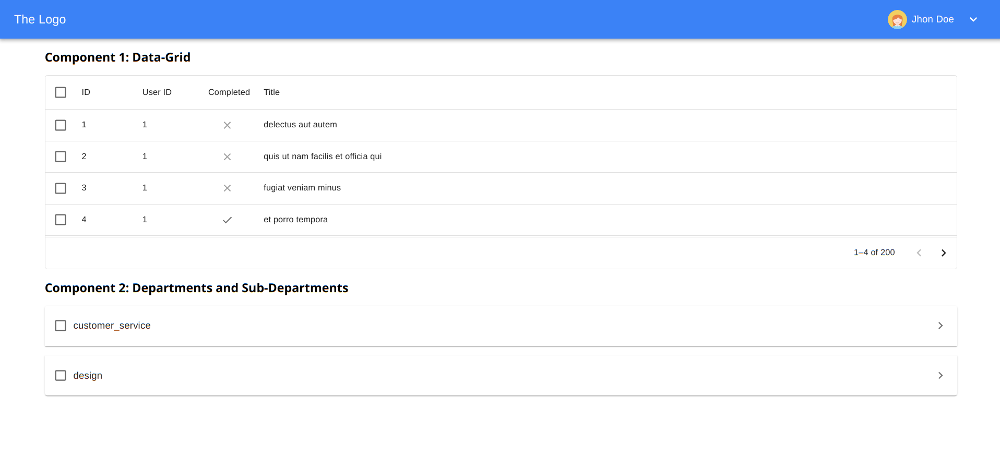

# GrowMeOrganic Assignment

This project is the result of an internship assignment for GrowMeOrganic.

## Overview

This React-based web application was developed as part of the GrowMeOrganic internship assignment. It demonstrates various skills and features as required by the assignment instructions.

## Assignment Instructions

For detailed instructions related to this assignment, please refer to the [Assignment Instructions](https://link-to-assignment-instructions).

## Features

- **Application Configuration:** Built using Vite and React.
- **User Authentication:** Includes a login page with user data stored in local storage.
- **Data Display:** Utilizes tables to display data retrieved from an API.
- **Department and Sub-Department Component:** Implements a component that displays department and sub-department data.
- **Deployment:** The application is deployed on Netlify.

## Live Site

You can explore the live version of this project [here](https://dashing-faloodeh-a2aca4.netlify.app/).

## Getting Started Locally

To run this project locally:

1. Clone the GitHub repository:

   ```bash
   git clone https://github.com/amuwal/Assignment-GrowMeOrganic.git
   ```

2. Navigate to the project directory:

   ```bash
   cd Assignment-GrowMeOrganic
   ```

3. Install dependencies:

   ```bash
   npm i
   ```

4. Start the development server:
   ```
   npm run dev
   ```

## Homepage


